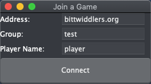

# alttp-multiplayer
ALTTP Multiplayer script integration for [bsnes-angelscript](//github.com/JamesDunne/bsnes-angelscript).

See a demo video: https://www.youtube.com/watch?v=_MTfXCUXawg

Join us on discord! https://discord.gg/AVQ2yKd

# Play with a friend over the Internet

**PREREQUISITES**: You need your own copy of the ALTTP game ROM image. DO NOT ASK ME FOR ONE; I will ignore you so hard. It is illegal to redistribute ROM images.

1. Download the pre-built package for your system: https://cirrus-ci.com/github/JamesDunne/alttp-multiplayer/master
1. **IMPORTANT**: If you cloned the github repository then stop, go back to step 1, and download the pre-built image for your system instead.
1. Launch `bsnes.exe` (Windows) or `bsnes.app` (macOS), depending on your system.
1. In bsnes, System > Load Game... and find your ALTTP ROM.
1. In bsnes, Script > Load Script File... and select `alttp-script.as` from the current directory.
1. Find the "Join a Game" window that should have popped up after loading the script. It may have popped under the main BSNES window. 
1. Find a friend to play with; make sure they follow all these steps up to this point.
1. Leave the "Address" field alone unless you intend on running your own ALTTP multiplayer server instance. [See below](#running-your-own-server) if you wish to do so.
1. Agree with your friend on a unique group name and enter it into the "Group" field. This group name can be anything but make sure it's unique enough for others not to guess otherwise they might be able to join your game.
1. Enter your player name in the "Player Name" field. Currently this name doesn't matter very much because players don't have a way to see player names yet.
1. Click "Connect" button.
1. Play through the game together and report bugs and/or feature requests back to me at https://github.com/JamesDunne/alttp-multiplayer/issues .

Thanks for testing!

# Running Your Own Server

If you wish to run your own ALTTP multiplayer server, you will need:

1. a server, publicly accessible from the Internet
1. a static IP address assigned to your server
1. optionally a DNS name assigned to your static IP address
1. access to UDP port 4590 through firewall
1. server operating system supported by Golang 1.12+ (linux is preferable)
1. golang development environment installed on the server

Log in to your server (I'll assume it's Linux or at least has a bash-like shell) and follow these steps:

TODO: elaborate on this better!!!
1. `go install github.com/JamesDunne/alttp-multiplayer/alttp-server`
1. `$HOME/go/bin/alttp-server`

Consult your system documentation on how to create a service wrapper around the `alttp-server` process.

My server is running an older variant of Ubuntu 14.04 LTS and as such still uses the old `upstart` service manager. Here is my `/etc/init/alttp-server.conf` upstart conf file for reference:

```
# configuration for upstart

description     "ALTTP UDP multiplayer group server on port 4590"
author          "James Dunne <james.jdunne@gmail.com>"

start on runlevel [2345]
stop on starting rc RUNLEVEL=[016]

respawn
respawn limit 2 5

setuid nobody
setgid nogroup

console log
exec /srv/bittwiddlers.org/go/bin/alttp-server
```

The main takeaways here are that you just need a nice place to store the compiled binary `alttp-server` and you should be able to run it as `nobody` UID with `nogroup` GID to limit its access to the rest of your system. Definitely DO NOT run it as a privileged user of any kind. The less privileges it has, the better. All it needs to do is bind to UDP port 4590 and send UDP messages and nothing else.
